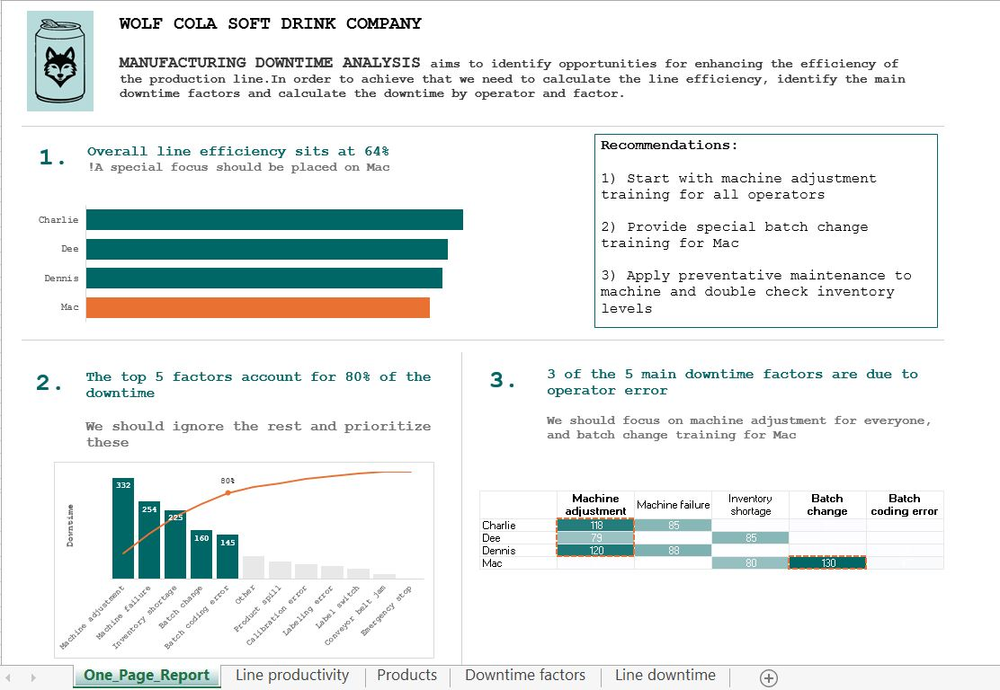

# Data Analytics Portfolio

## Manufacturing Downtime Analysis (MS Excel)

MANUFACTURING DOWNTIME ANALYSIS aims to identify opportunities for enhancing the efficiency of the production line. In order to achieve that we need to calculate the line efficiency, identify the main downtime factors and calculate the downtime by operator and factor.

The data set and accompanying guidance have been sourced from [Maven Analytics](https://app.mavenanalytics.io/guided-projects)

## NYC Collisions Analysis (MS Excel)

The objective of the NYC COLLISIONS ANALYSIS is to identify patterns and trends in the NYPD traffic accident dataset in order to help prevent future accidents. To accomplish this objective, it is essential to examine the data on collisions by year, with particular attention to the impact of seasonal and monthly variations. The same analysis should be applied to the time of day/day of week, to determine whether certain times of the day affect the number of collisions. Another interesting area of investigation would be if there is any correlation between the number of collisions and the severity of the accident, taking into account contributing factors.

The data set and accompanying guidance have been sourced from [Maven Analytics](https://app.mavenanalytics.io/guided-projects)
